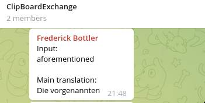
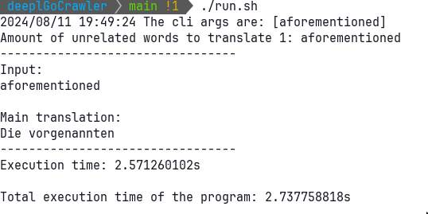
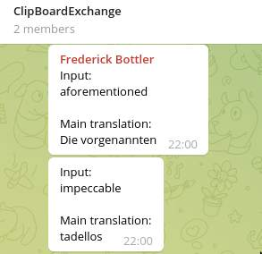
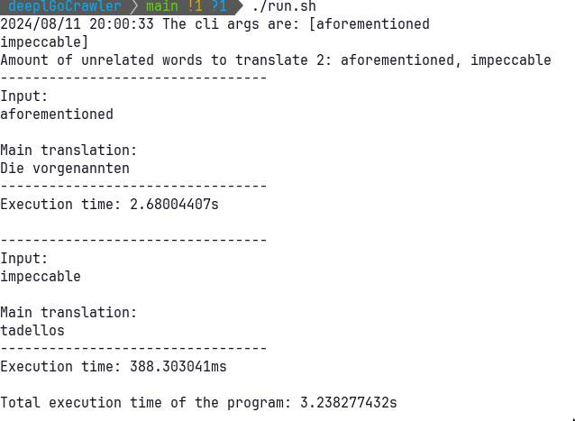

# Overview
- The `crawl/deepl` project is a Go-based application (`go 1.22.0`) designed to translate the contents of your current clipboard-storage using Deepl's web interface from [your desired language to another desired language](#setup-desired-languages-in-an-env-file) and optionally send the translations via a [Telegram bot](#setup-telegram-bot).
- The application leverages Docker to ensure a consistent and isolated environment for development and execution.
- It serves as a project for me to learn the Golang programming language. Feel free to give feedback or open pull requests.

## Current Setup
### How It Works
- **Starting the application**: The application is run in a [docker container](#docker-setup), when starting it the current clipboard-contents is retrieved and passed as an argument which is to be translated
- **Initialization**: The application first checks for an active internet connection.
- **Chrome Context**: A Chrome context is created to allow headless browsing.
- **Translation**: The text is translated by navigating to the Deepl website and extracting the translated text using Chromedp.
- **Output**: The translated text is output to the console, and if a Telegram bot is set up, it sends the translation via Telegram.

### How it looks
##### 1. Case
- Lets say I copy
```bash
aforementioned
```
*The Telegram bot*:



*The The Standart output*:



##### 2. Case
- Lets say I copy
```bash
aforementioned
impeccable
```
... phrases separated by a linebreak

*The Telegram bot*:



*The The Standart output*:



The phrases are split at the linebreaks and are translated separately

### Setup desired Languages in an `.env` file
- `FROM_LANGUAGE` is the language in which the input is expected
- `TO_LANGUAGE` is the language to which the application input is translated

```bash
FROM_LANGUAGE=
TO_LANGUAGE=
```

### Requirements
- Docker: Ensure Docker is installed on your system. [Docker Documentation.](https://docs.docker.com/get-docker/)
- Xclip: Ensure the Xclip utility is installed on your system. [xclip](https://wiki.ubuntuusers.de/xclip/)

### Setup Telegram bot
1. Get your Bot-Token and Chat-ID: https://core.telegram.org/bots

2. Create an `.env` file

3. Set the following variables in the `.env` file:
- `BOT_TOKEN`: Your Telegram bot token.
- `CHAT_ID`: Your Telegram chat ID.

```bash
BOT_TOKEN=
CHAT_ID=
```

### Docker Setup

#### Development Environment
- The development environment is defined in `docker-compose.dev.yml` and starts a container named `goCrawlDevtainer` and a container named `webServerDevtainer`.

#### Production Environment
- The production environment is defined in `docker-compose.yml` and starts a container named `goCrawlApp`.

### Development
#### Build the Development Container:
```bash
docker compose -f docker-compose.dev.yml build
```
##### Start the Development Container:
```bash
docker compose -f docker-compose.dev.yml up
```
##### Connect to the Development Container:
```bash
docker exec -it goCrawlDevtainer bash
```

### Development - Testing
- To run the unit-tests manualy:
```bash
docker exec -it goCrawlDevtainer bash
make test
```
aftert that? Go visit 
```bash
localhost:8080
```
 where the `webServerDevtainer` has spun up a simple webserver, serving the current test coverages

### Development - Run the Application:
Inside the container, run one of the following commands to start the translation:
```bash
make run ARGS="word to translate"
```
### Production
#### Build the Production Container:
```bash
./build.sh
```
#### Start the Production Container:
```bash
./run.sh
```
The run script will fetch the content of your clip board and run its translation.

# Note for future Chris that still uses i3:

```
bindsym $mod+Ctrl+P exec --no-startup-id /home/christoph/projects/GoCrawlDeepl/run.sh
```
